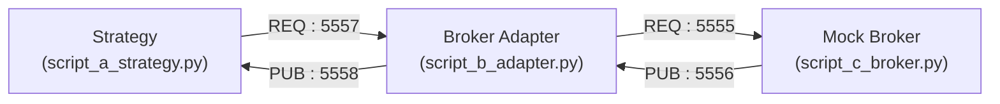

# Task 1 – ZeroMQ Distributed Trading System

A simple distributed trading system built using **ZeroMQ** that simulates communication between a trading strategy, a broker adapter, and a mock broker.

The project demonstrates request-response messaging for order placement and publish-subscribe messaging for execution reports and market data.

---

# Architecture



---

# Communication Flow

### Order Placement

```
Strategy
    │
    ▼
Broker Adapter
    │
    ▼
Mock Broker
```

Orders are placed synchronously using the **REQ/REP** pattern so every order receives an acknowledgement before the next one is sent.

---

### Execution & Market Updates

```
Mock Broker
    │
    ▼
Broker Adapter
    │
    ▼
Strategy
```

Execution reports and order book updates are broadcast asynchronously using the **PUB/SUB** pattern.

---

# Features

- ZeroMQ based inter-process communication
- Decoupled Strategy, Adapter and Broker
- Order routing through Broker Adapter
- Live execution updates
- Order Book maintenance
- Open Position tracking
- Realised PnL calculation
- Pydantic based message validation

---


# Project Structure

```
task1_zmq/
├── requirements.txt
├── schemas.py
├── script_a_strategy.py
├── script_b_adapter.py
├── script_c_broker.py
├── test_broker.py
└── README.md
```

| File | Description |
|------|-------------|
| `script_a_strategy.py` | Trading strategy that places orders and maintains portfolio state |
| `script_b_adapter.py` | Routes orders between the strategy and the broker while forwarding market updates |
| `script_c_broker.py` | Mock broker that validates and executes incoming orders |
| `schemas.py` | Shared Pydantic models used for message validation and serialization |
| `test_broker.py` | Utility script for testing the broker independently with custom requests |
---

# Design Decisions

### Broker Adapter

The strategy communicates only with the broker adapter rather than the broker directly.

This abstraction allows the trading strategy to remain independent of broker-specific communication and makes it easier to replace or extend the broker implementation.

---

### Message Validation

All network payloads are represented using shared Pydantic models defined in `schemas.py`.

This provides:

- Type safety
- Input validation
- Consistent serialization
- Easier debugging

---

### Concurrent Message Handling

The broker adapter uses a **ZeroMQ Poller** to listen for both incoming orders and broker updates simultaneously without blocking either communication channel.

---

### Background Market Listener

The strategy runs a dedicated background thread that continuously listens for execution reports and market data while the main thread submits orders.

This allows order submission and portfolio updates to happen concurrently.

---

### Portfolio Management

The strategy maintains its own portfolio state and updates the following after every execution:

- Current Position
- Average Entry Price
- Realised PnL
- Latest Order Book

---

# Requirements

- Python 3.11+
- ZeroMQ
- Pydantic

Install dependencies:

```bash
pip install -r requirements.txt
```

---

# Running the Project

Start each service in a separate terminal.

### Terminal 1

```bash
python script_c_broker.py
```

### Terminal 2

```bash
python script_b_adapter.py
```

### Terminal 3

```bash
python script_a_strategy.py
```

The strategy automatically submits five sample BUY and SELL orders.

During execution the dashboard displays:

- Order acknowledgements
- Open Positions
- Average Entry Price
- Realised PnL
- Live Order Book updates

---

# Assumptions & Simplifications
- Orders are always 100% filled (no partial fills) to keep the demo focused on message flow.
- One malformed order is deliberately included to demonstrate broker-side rejection handling.
- No reconnect/timeout logic on the adapter↔broker leg — acceptable for a local demo, would add zmq.RCVTIMEO in a production setting.
- Single symbol (AAPL) and single strategy instance for simplicity.

---

# Technologies

- Python
- ZeroMQ (pyzmq)
- Pydantic