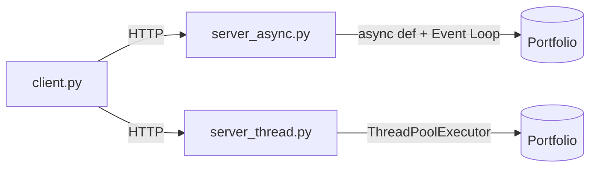

# Task 2 – REST API with FastAPI (Concurrency Demo)

A RESTful API built with **FastAPI** simulating a simple order entry and portfolio system.

The core requirement of this task is to demonstrate two different concurrency models in Python:

1.  **Asyncio (`server_async.py`)**
2.  **Threading (`server_thread.py`)**

----------

# Architecture



Only one server runs at a time — both listen on port 8000.

----------

# Project Structure

```
task2_rest/
├── requirements.txt
├── client.py
├── server_async.py
├── server_thread.py
└── README.md

```


| File | Description | 
|------|-------------|
| `client.py` | Load-testing script that fires 5 concurrent requests |
| `server_async.py` | FastAPI server using single-thread Event Loop (`async def`) |
| `server_thread.py` | FastAPI server using background ThreadPoolExecutor (`def`) |

----------

# The Two Concurrency Models

### Asyncio Version

-   Uses `async def` endpoints and `await asyncio.sleep()` to simulate I/O latency.
-   Runs on a single thread with an event loop. While one request is "waiting" on simulated I/O, the loop is free to pick up other incoming requests.

### Threading Version

-   Uses standard synchronous `def` endpoints and blocking `time.sleep()`.
-   FastAPI automatically offloads synchronous endpoints to a background `ThreadPoolExecutor` (default 40 workers), so a blocking call in one request doesn't freeze the whole server.
-   Each request logs its `threading.get_ident()` so you can see a distinct OS thread handling each concurrent order.

----------

# Load Testing

`client.py` uses `concurrent.futures.ThreadPoolExecutor` to fire multiple HTTP POST requests at the server close to simultaneously, then times how long the batch takes to fully resolve.

At the default load (5 concurrent requests with a 1s simulated delay each), **both servers finish in roughly the same time (~1s)**. This is expected — FastAPI's threadpool (40 workers) comfortably covers 5 concurrent requests, so the threading version isn't yet under enough load to show its limits.

The real difference between the two models appears at higher concurrency: asyncio continues to scale on a single thread, while the threading version is ultimately bounded by the size of its thread pool and OS thread overhead. Increasing `NUM_ORDERS` in `client.py` well past 40 is the way to observe that divergence directly (e.g. threading requests start queuing/serializing once the pool is exhausted).

----------

# How to Run

You will need two terminal windows.

### Step 1: Start a server

Either the asyncio version:

```bash
python server_async.py

```

or the threading version:

```bash
python server_thread.py

```

### Step 2: Run the load test

```bash
python client.py

```

Watch Terminal 1 to see the server process concurrent requests, and Terminal 2 to see the portfolio update after all requests complete.

----------

# Assumptions & Simplifications

-   Both servers use a plain in-memory dict as a mock store and are **not thread-safe** — the threading version has a genuine (if rare at low concurrency) race condition on writes to `mock_database`. A `threading.Lock` would fix this; left out here to keep the demo focused on the concurrency model itself rather than data integrity.
-   At the default load (5 requests), FastAPI's threadpool means both models perform similarly. Higher concurrency is needed to see threading's ceiling versus asyncio's continued scaling — noted above rather than hard-baked into the default demo run.
-   Only one server (async or threaded) runs at a time; both bind to port 8000.
-   `time.sleep()` / `asyncio.sleep()` stand in for real I/O (e.g. a database or broker call) to keep the demo dependency-free.

----------

# Requirements

-   Python 3.11+
-   FastAPI
-   Uvicorn
-   Requests

Install dependencies:

```bash
pip install -r requirements.txt

```

----------

# Technologies

-   Python
-   FastAPI
-   Uvicorn
-   Requests